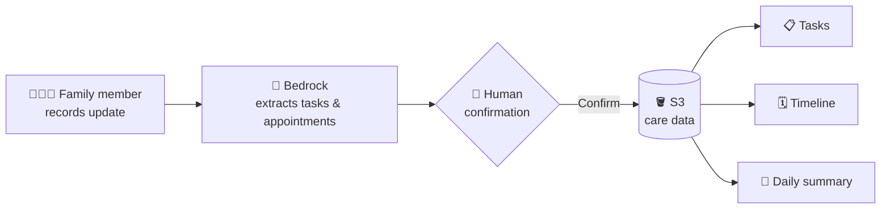

<div align="center">


<a href="https://github.com/ashukmr03/wemakedev">
  
</a>

<br/>


<br/>

[](https://care-circle-three-psi.vercel.app)


</div>

---

## ✨ About

**CareCircle** is a FastAPI backend for eldercare coordination. Families can:

- 📝 **Record** care updates in everyday language
- 🤖 **Extract** structured information using **Amazon Bedrock**
- ✅ **Manage tasks** and track **appointments**
- 📅 **View** a reverse-chronological care timeline
- 🧾 **Get** AI-generated daily summaries

---

## 🔄 How It Works



---

## 🚀 Quick Start (Local Run)

### 1️⃣ Install Dependencies

```bash
pip install -r requirements.txt
```

### 2️⃣ Configure Environment Variables

Copy `.env.example` to `.env`:

```bash
cp .env.example .env
```

### 3️⃣ Run FastAPI Server

```bash
uvicorn app.main:app --reload --host 0.0.0.0 --port 8000
```

📖 Swagger UI will be available at: <http://localhost:8000/docs>

---

## 🌐 Deploying to Render (Without Docker)

1. Create a **New Web Service** on Render connected to your repository.
2. Select **Python 3** environment.
3. Set **Build Command**:

```bash
   pip install -r requirements.txt
```

4. Set **Start Command**:

```bash
   uvicorn app.main:app --host 0.0.0.0 --port $PORT
```

5. Add Environment Variables in Render Dashboard:

   | Variable | Value |
   | --- | --- |
   | `S3_BUCKET` | `carecircle-data` |
   | `AWS_REGION` | `us-east-1` |
   | `AWS_ACCESS_KEY_ID` | `<your-aws-access-key-id>` |
   | `AWS_SECRET_ACCESS_KEY` | `<your-aws-secret-access-key>` |
   | `BEDROCK_MODEL_ID` | `amazon.nova-lite-v1:0` (or `us.amazon.nova-lite-v1:0` in US regions) |
   | `FRONTEND_URL` | `https://your-vercel-app.vercel.app` |

---

## ☁️ AWS Setup Checklist

- [ ] **Amazon S3**: create a private bucket named `carecircle-data` (or update `S3_BUCKET` in env).
- [ ] **Amazon Bedrock**: enable model access for `Amazon Nova Lite` (Bedrock → Model access).
- [ ] **AWS IAM**: allow `s3:GetObject`, `s3:PutObject`, `s3:ListBucket`, `s3:DeleteObject`, and `bedrock:InvokeModel` / `bedrock:Converse`.

---

## 📡 Core API Contract

| Method | Endpoint | Description |
| :---: | --- | --- |
| `GET` | `/health` | Uptime & health status |
| `GET` | `/api/system/status` | S3 & Bedrock status |
| `GET` | `/api/dashboard` | Single-request full dashboard payload |
| `POST` | `/api/ai/extract` | Bedrock structured care update extraction |
| `POST` | `/api/care/confirm` | Human confirmation & entity creation |
| `GET` | `/api/care/timeline` | Reverse-chronological care timeline |
| `GET` | `/api/tasks` | List tasks |
| `PATCH` | `/api/tasks/{taskId}/complete` | Complete task |
| `POST` | `/api/ai/summary` | Generate AI daily summary |

---

<div align="center">

Made with ❤️ for the people who care for the people we love.


</div>
